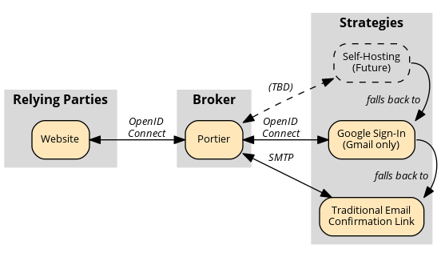

# Portier's Design

Portier is a passwordless login system masquerading as an OpenID Connect provider.

It works like Facebook Connect or Google Sign-In, but for _any_ email address. It's also self-hostable: your users maintain control of their identity and you maintain control of your site's authentication.

The Portier Broker exposes a public API that implements the [OpenID Connect Core](http://openid.net/specs/openid-connect-core-1_0.html) "[Implicit Flow](http://openid.net/specs/openid-connect-core-1_0.html#ImplicitFlowAuth)." This is how websites interact with Portier and ask it to verify email addresses.

When the user completes authentication, proof is `POST`ed to the website's as a [JWT](https://jwt.io) signed by the Broker.

Learn more about [the specifications](Specs.md) involved.

## Authentication Strategies

Behind the scenes, the Broker selects the best strategy for verifying an email address from a prioritized list including Google Sign-In and traditional email-based confirmation loops. Specifically, it considers:

1.  __Dynamic Discovery (Protocol TBD)__: In future releases, Portier will specify a protocol for domains that want to offer a modern, in-browser verification experience for their users. This is also important for individuals with their own domains, who want complete control over how they authenticate their own identity. We're [currently investigating](https://github.com/portier/portier.github.io/issues/13) the suitability of OpenID Connect Discovery and Dynamic Registration for this purpose.

2.  __Google Sign-In (OpenID Connect)__: Given its prominence and quirks, we provide special support for Gmail users. Unfortunately, the Broker cannot use this strategy without [pre-registering with Google](https://developers.google.com/identity/protocols/OpenIDConnect) and obtaining API credentials.

3.  __Traditional Email Confirmation (SMTP)__: As a strategy of last resort, the Broker will fall back to sending a single use confirmation token over email to the address in question. Clicking this "magic link" proves that the user has control over the address.

    Email loops are imperfect: they require a context switch and messages can become delayed or even stuck in filters. However, they're also the only truly universal strategy. By definition, all working email addresses are capable of completing this workflow.

    To make this less painful, Portier attempts to learn from [other projects](OtherProjects.md). We use "magic links" so that just clicking on the link is sufficient to return the user to the originating website and establish a session. The confirmation emails also include short alphanumeric codes that the user can manually transcribe. This facilitates a workflow whereby the user initiates a login on one device, glances at their smartphone's notifications for the code, and retypes it to complete authentication on the original device. This use is especially valuable when using untrusted devices, as the user is not required to log into their email account on the device itself.

In the future, we may introduce other provider-specific bridges or protocols for dynamic discovery, but the priorities will remain the same: attempt to authenticate directly with the domain using a mechanism it specifies, fall back to per-provider shims, and finally resort to a traditional email loop.

## Engineering Principles

We strive to ensure that Portier is:

1.  __Maintainable__:  As a community-driven project, our survival is directly tied to the clarity and simplicity of our code. Barriers to contribution must be kept as low as possible so that new and part-time contributors are able to move the project forward without a dedicated investment of time.

2.  __Effectively Stateless__: While caches, configuration, and short-lived state are fine, Portier should never *require* durable, persistent state. This significantly reduces operational complexity and ensures that broker upgrade, recovery, and migration paths are sane.

3.  __Simple to Deploy__: The broker must ship as a single, statically compiled binary for ease of deployment. For our promise of self-hosting to be meaningful, we can't expect users to know (or be willing to manage the complexity of) Docker, Virtualenv, Bundler, NPM, or similar tools. The deployment story must be "scp this binary, edit this config file, run it," with addenda for systemd or supervisor to make sure it comes back up from failures.

4.  __Language Agnostic__: Everything on the Web speaks HTTP. So does Portier. Life's too short to reimplement authentication for every popular framework.

5.  __Secure__: Communication with a Portier broker must occur over a secure (SSL/TLS) connection. The reference broker will itself be written in Rust to ensure that it is free from memory safety issues.

6.  __Open__: Nothing in the _protocol_ should require websites to pre-register with a Portier Broker before using it. Individual brokers may, of course, choose to limit what websites they service.

7.  __Transparent__: Portier verifies email addresses. It does not itself have a notion of accounts, and it does not attempt to obscure email addresses before returning them to relying websites. Since email addresses are portable identifiers, websites can freely and autonomously migrate to or away from Portier without worries regarding lock-in.

8.  __Scalable__: A single broker can service requests from an arbitrary number of relying sites.

It's very important to us that motivated hobbyists are able to easily and securely run their own broker and provider. [Redecentralize the web!](http://redecentralize.org/)
