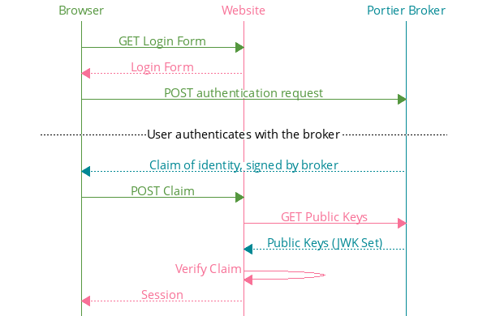

# Portier's Design

Portier is a passwordless login system masquerading as an OpenID Connect provider. It can authenticate _any_ email address, so it works for everyone.

Websites interact with Portier using an API that matches [OpenID Connect](http://openid.net/specs/openid-connect-core-1_0.html)'s "[Implicit Flow](http://openid.net/specs/openid-connect-core-1_0.html#ImplicitFlowAuth)." The rough outline looks something like this:

In short:

1. Websites redirect users to a Portier Broker when they want to log in.
2. The broker attempts to verify the user's claimed identity.
3. If successful, the user returns to the website with a token signed by the broker.
4. The website attempts to cryptographically verify that the token is valid.
5. If successful, the website accepts the user's claim to the identity in the token and establishes a session.

_How_ the broker verifies claimed identities is an implementation detail; websites can treat it as a black box. The site just needs to know how to delegate, receive, and verify identity claims.

Websites use [OpenID Connect Discovery](http://openid.net/specs/openid-connect-discovery-1_0.html) to locate a broker's authentication endpoint and public keys.

You can experiment with raw OpenID Connect at Auth0's [OpenID Connect Playground](https://openidconnect.net), or explore our own documentation on the [specifications used by Portier](https://github.com/portier/portier.github.io/blob/master/Specs.md).

## Authentication Strategies

Behind the scenes, the Broker selects an authentication strategy from a prioritized list including Google Sign-In and traditional email-based confirmation loops. Specifically, it considers:

1.  __Dynamic Discovery (Protocol TBD)__:

    In future releases, Portier will specify a protocol for domains that want to offer a modern, in-browser verification experience for their users. We're [currently investigating](https://github.com/portier/portier.github.io/issues/13) the suitability of OpenID Connect Discovery and Dynamic Registration for this purpose.

2.  __Google Sign-In (OpenID Connect)__:

    Due to its prominence, Portier provides special support for Gmail users. Unfortunately, the Broker cannot use this strategy without [pre-registering with Google](https://developers.google.com/identity/protocols/OpenIDConnect) and obtaining API credentials.

3.  __Traditional Email Confirmation (SMTP)__:

    As a strategy of last resort, the Broker falls back to sending single use confirmation tokens over email. Accessing the token proves that the user has control over the address. Email loops are imperfect, but they are the only universal strategy: by definition, all working email addresses are capable of completing this workflow.

    To reduce friction, Portier learns from [other projects](OtherProjects.md) and implements one-click "magic links." It also includes a short confirmation code in every verification email as an alternative to clicking the link. This makes it possible to log into an untrusted system by glancing at a trusted device, like a smartphone, and manually transcribing the confirmation code.

We may introduce other discovery protocols or provider-specific bridges, but dynamic discovery will always take the highest priority and email loops the lowest.

## Engineering Principles

We strive to ensure that Portier is:

1.  __Maintainable__:  As a community-driven project, our survival is directly tied to the clarity and simplicity of our code. Barriers to contribution must be kept as low as possible so that new and part-time contributors are able to move the project forward without investing significant, uninterrupted time.

2.  __Effectively Stateless__: While caches, configuration, and short-lived state are fine, Portier must *never* require persistent state. This significantly reduces operational complexity and ensures that broker upgrade, recovery, and migration paths are sane.

3.  __Simple to Deploy__: The broker must ship as a single, statically compiled binary for ease of deployment. For our promise of self-hosting to be meaningful, we can't expect users to know (or be willing to manage the complexity of) Docker, Virtualenv, Bundler, NPM, or similar tools.

4.  __Language Agnostic__: Everything on the Web speaks HTTP. So does Portier. It's a microservice for the masses.

5.  __Secure__: Communication with a Portier broker must occur over a secure (SSL/TLS) connection. The reference broker will be written in Rust to avoid memory safety vulnerabilities.

6.  __Open__: Nothing in the _protocol_ should require websites to pre-register with a Portier Broker. Of course, individual brokers may limit the websites they service.

7.  __Transparent__: Portier does not attempt to mangle or obscure email addresses. Since email addresses are portable identifiers, websites can freely migrate to or and from Portier without lock-in.

8.  __Scalable__: A single broker can service requests from an arbitrary number of relying sites.

It's very important to us that motivated hobbyists are able to easily and securely run their own broker and provider. [Redecentralize the Web!](http://redecentralize.org/)
